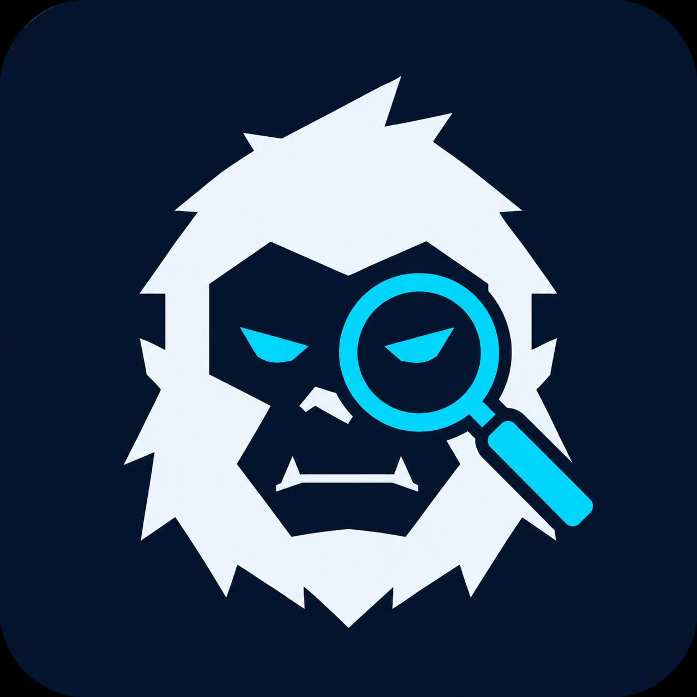

<p align="center">
  
</p>

<h1 align="center">YetiScan</h1>
<p align="center"><em>AI-Powered Blockchain Intelligence for Sui Network</em></p>

<p align="center">
  
  
  
</p>

---

YetiScan is an AI-powered token and contract scanner built natively for Sui, turning complex blockchain data into simple, actionable insights for builders, traders, and everyday users.

---

## Features

### Token Intelligence

- **Trust Score** — Algorithmically calculated from holder concentration, supply distribution, and on-chain signals
- **Holder Distribution** — Visual breakdown of the top wallets and what percentage of supply they control
- **Market Snapshot** — Real-time price, market cap, 24h volume, liquidity, and buy/sell pressure from BlockVision
- **AI Intelligence Report** — Plain-English analysis of what the data actually means, with Pro and Fun modes powered by Claude

### Contract Explainer

- **Security Snapshot** — Automated detection of mint authority, pause functions, admin controls, burn capability, and blacklists
- **Public Function Inspector** — Lists every exposed function in the package so you know exactly what a contract can do
- **AI Contract Explainer** — Claude reads the module names and functions and explains what the contract does and whether it's safe to interact with
- **Ask YetiScan** — Contextual Q&A: tap a generated question and get a 2-3 sentence direct answer from the AI

---

## Tech Stack

| Layer | Technology |
|---|---|
| Frontend | Vanilla JS + CSS (no framework) |
| Blockchain | Sui RPC (`fullnode.mainnet.sui.io`) |
| Market Data | BlockVision |
| AI | Claude by Anthropic (`claude-sonnet-4-5`) |

---

## Getting Started

### Prerequisites

- Node.js 18+
- API keys for Anthropic, BlockVision, and (optionally) Birdeye

### Installation

```bash
git clone https://github.com/your-username/yetiscan.git
cd yetiscan
npm install
```

### Environment Variables

Copy `.env.example` to `.env` and fill in your keys:

```env
ANTHROPIC_API_KEY=
BLOCKVISION_API_KEY=
```

### Run

```bash
npm run dev
```

Then open [http://localhost:3000](http://localhost:3000).

---

## Usage

**Token Analysis**

Paste a full Sui coin type into the search box and hit Scan:

```
0x7016aae72cfc67f2fadf55769c0a7dd54291a583b63051a5ed71081cce836ac6::sca::SCA
```

You'll get the trust score, holder distribution, market data, and an AI report — all in one view.

**Contract Explainer**

Switch to the Contract tab and paste a package address:

```
0x7016aae72cfc67f2fadf55769c0a7dd54291a583b63051a5ed71081cce836ac6
```

YetiScan will pull the package modules, inspect public functions, flag any security risks, and have Claude explain what the contract actually does in plain English.

---

## Project Structure

```
yetiscan/
├── server.js        # Express server — API proxy for Claude + BlockVision
├── index.html       # Single-page frontend
├── app.js           # All frontend logic (scanning, rendering, AI calls)
├── style.css        # Full theme system (dark/light) + all component styles
├── icon.jpg         # YetiScan logo
├── .env.example     # Environment variable template
└── package.json
```

---

<p align="center">
  Built for <strong>Lofi-Yeti Hackathon</strong> · Sui Network · Built by Lord4T6
</p>
